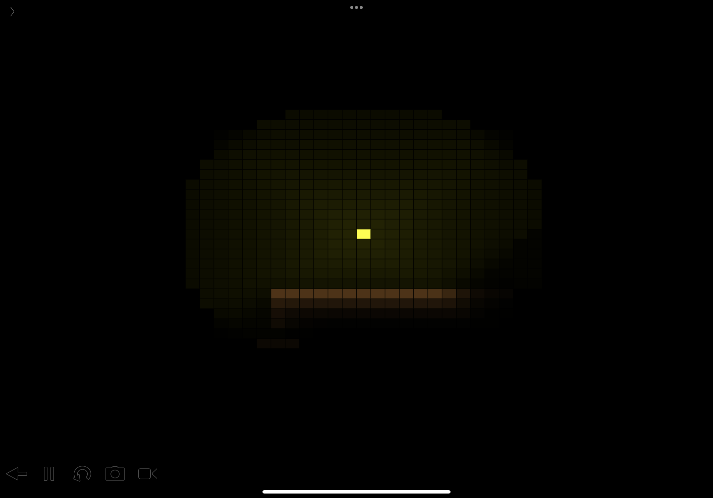

# Codea-examples ( learn how to code games by studying examples )
Starting out, game mockups, remakes, tools, ai, procgen

I just bought codea(aug-2021) Maybe I might create hundreds of little projects and examples in this repo.

learning lua....

Dotate to author (book and motivation funds) https://www.paypal.me/RudyvanEtten/5

Codea is a ios and ipados programming tool. It can be bought from the apple app store.

 
example lighting tilemap

 
 
 

